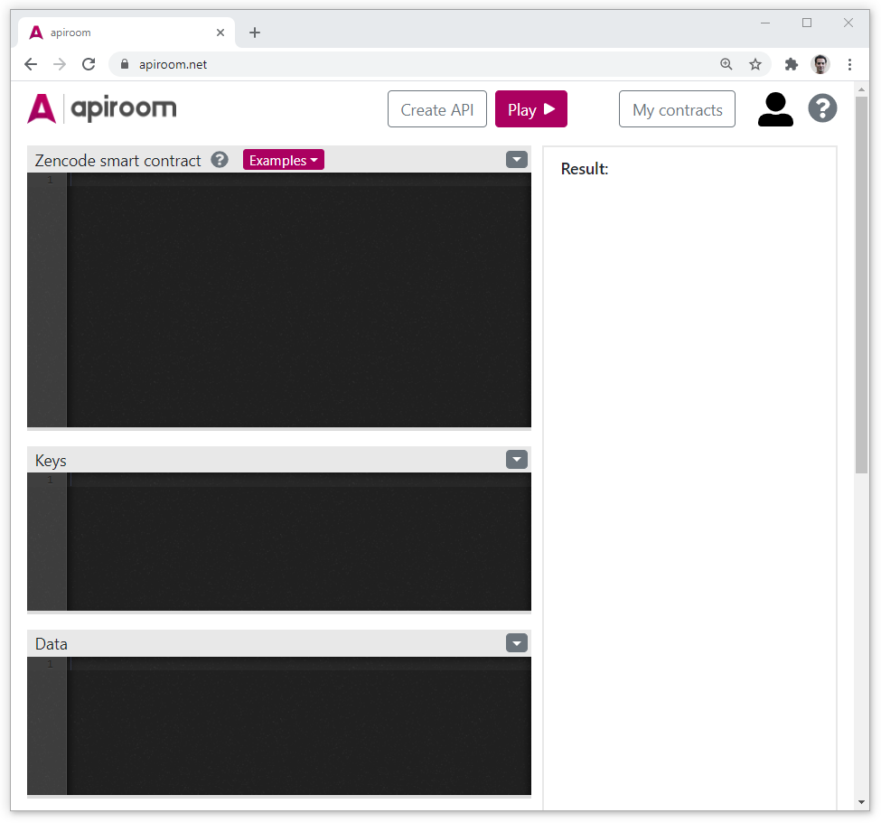
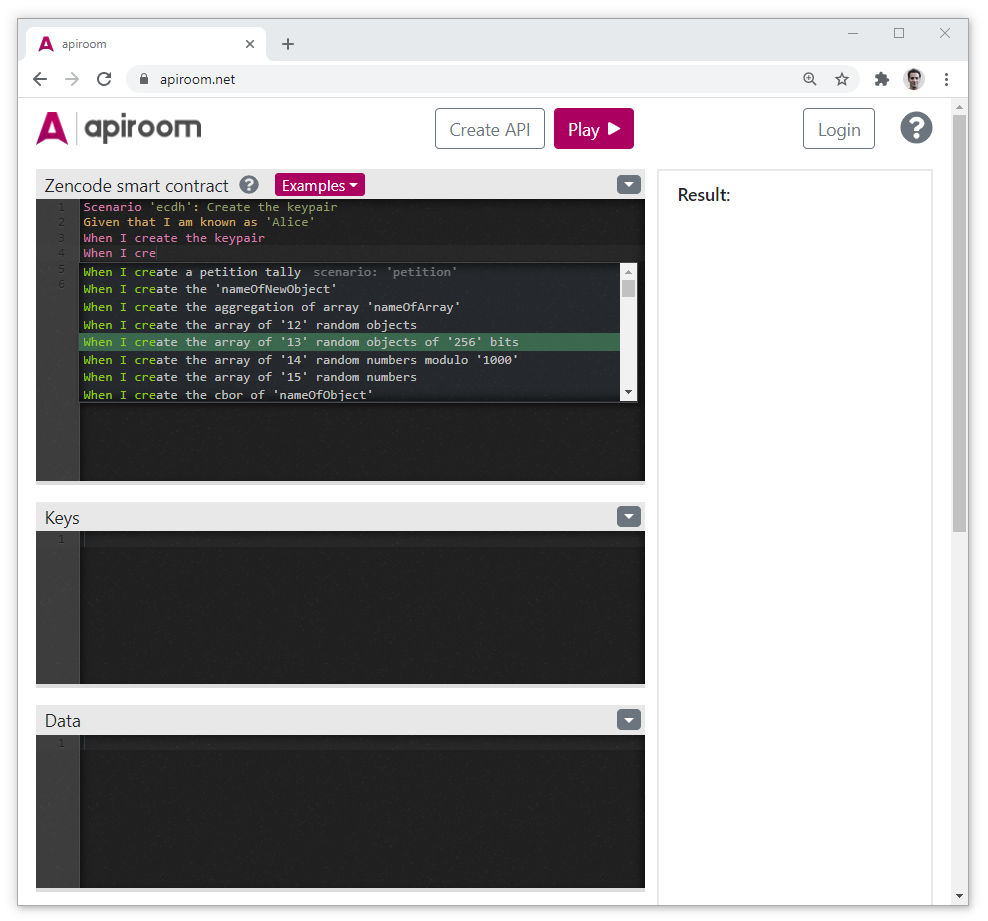
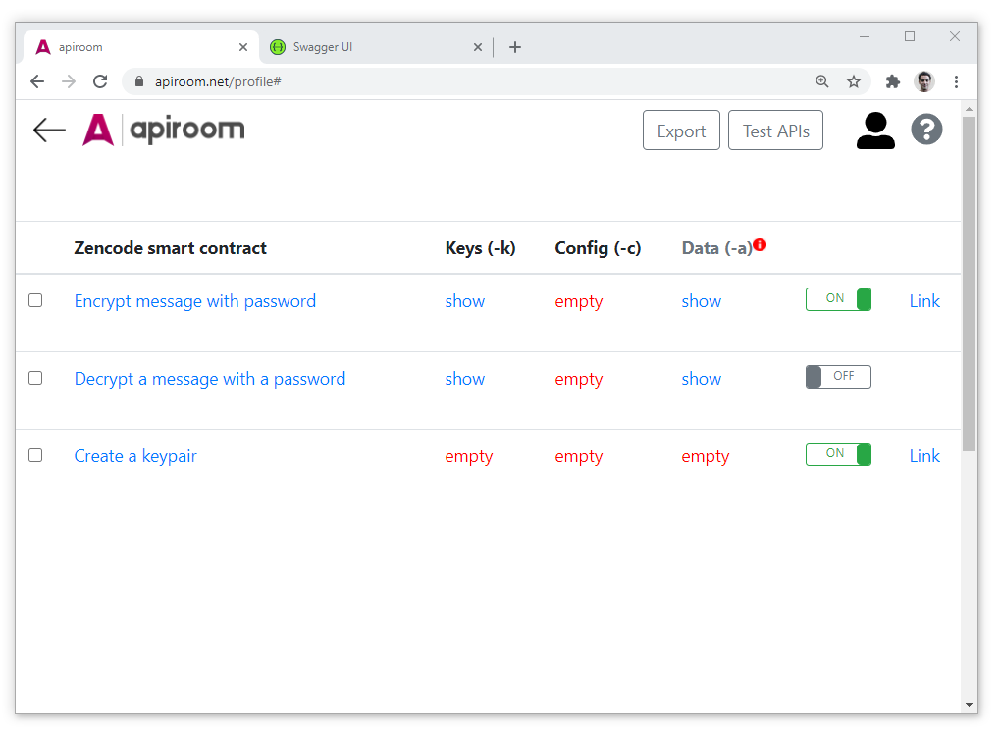

<!-- Unused files 
 
givenDebugOutputVerbose.json
givenLongOutput.json
 

Link file with relative path: <a href="./_media/examples/zencode_cookbook/givenArraysLoadInput.json">givenArraysLoadInput.json</a>
 
-->


This is the user manual of Zenroom's web playground [Apiroom](https://apiroom.net). Apiroom has built in: 

 - A [Zencode](/pages/zencode-intro) editor, equipped with auto-complete and syntax highlight
 - An in-the-browser Zenroom instance: you can use the editor to test your smart contracts and run them inside your browser window
 - An instance of [RESTroom-mw](/pages/restroom-mw) that enables you to create an API from a Zencode smart contract with one click
 - An instance of [Swagger ](https://swagger.io/) that you can use to test and debug the APIs you created

# Getting started

When landing on [Apiroom](https://apiroom.net) you're prompted with its front-end, where you have: 

- The text box **Zencode smart contract**: use it to type your [Zencode](pages/zencode-cookbook-intro) scripts
- The text boxes **Keys** and **Data** that you can use to pass different kind of data to Zenroom, as you would do with the parameters **-a** and **-k** from the command line application
 - The **Examples** drop-down menu, that fills the text boxes with sample Zencode smart contracts
- The text box named **Config** that you can use to pass [configuration](/pages/zenroom-config) files to Zenroom (in the front end only)
- The **PLAY▶️** button, that will execute the smart contracts, along with the keys and data you provided
- An output box to show you the output of the Zencode smart contract you executed

And also:

- The **Create API** button, that will save your smart contract and create an API from it (you need to be logged in to use it)
- The **Login** button that allows you to login and create an account
- After having logged in, the **My Contracts** button, to check, test and debug the APIs you have created from your Zencode smart contracts



# Let's start with an example: Generate a keypair

Press the **Examples** drop-down menu, and click on *Generate a keypair*


## Running a script 

After that, press the **PLAY▶️** button, and you should be presented with an [ecdh keypair](/pages/zencode-scenarios-ecdh?id=generate-a-keypair) in the **Result** box, looking like this:


# The auto-complete function

Now, in the **Zencode smart contract** text box, try and type *When I*: the auto-complete should be triggered, prompting you a window like this:



## Mastering the auto-complete

In the auto-complete window you can scroll up and down, and by clicking or pressing enter, the line will be inserted. The lines inserted will typically include a *dummy object name*, which some times will work straight of the box (like the example highlighted in the screenshot) but more often will need some adjustment. For example, the second statement from top:

```gherkin
When I create the 'nameOfNewObject'
```

will work and create a generic **simple object** named ***nameOfNewObject***. If you change ***nameOfNewObject*** to ***justThrowSomeName***, the statement will still work, cause its job is to create a new object whose name is defined between the quotation marks

But in the statement that is under it in the screenshot, we are in a very different situation: 

```gherkin
When I create the aggregation array of 'nameOfArray'
```

Here the statement is meant the perform the [aggregation](/pages/zencode-cookbook-when?id=basic-cryptography-hashing) of an array of ECP/ECP2 points (a cryptographical operation), so it's especting to be with an existing array. Therefore, as things are now, the statement will not work and throw an error.

If we look instead at the first statement in the screenshot, we first read: 

```gherkin
When I create a petition tally 
```

Followed by *scenario 'petition'* printed in a different color: this part indicates that in order to execute the statement, you need to load the [scenario 'petition'](/pages/zencode-scenarios-petition) in the top of the Zencode smart contract, as we did with the [scenario 'ecdh'](/pages/zencode-scenarios-ecdh) when we generated the keypair. Executing the script without the scenario will throw an error.


## The syntax highlight

The syntax highlight does not perform a syntax check, it's only there to help you read the Zencode smart contract easily, namely to help you make sure you are using the **Given**, **When** and **Then** statements as they should, in the right order.


# Login and check your APIs

If you aren't yet logged in, you can see the button **Login**. After logging in, you will be able to see **Create API** button, by pressing it you are prompted with a list of your saves Zencode smart contracts, turned into APIs: 




(to be continued)

<!-- WIP 

Here we'll see: 

- Under ***Zencode smart contract*** you rea the name 


## TEMP
 
We've done this already: let's start with create a file named *myLargeNestedObjectWhen.json*. This file contains everything we need for every part of this chapter and - along  with the *Given* part of the script, you can use this JSON to later make your own experiments with Zencode.

[](../_media/examples/zencode_cookbook/myLargeNestedObjectWhen.json ':include :type=code json')


[](../_media/examples/zencode_cookbook/whenCompleteScriptGiven.zen ':include :type=code gherkin')
 
-->